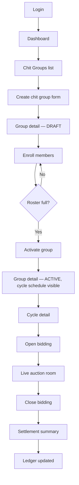
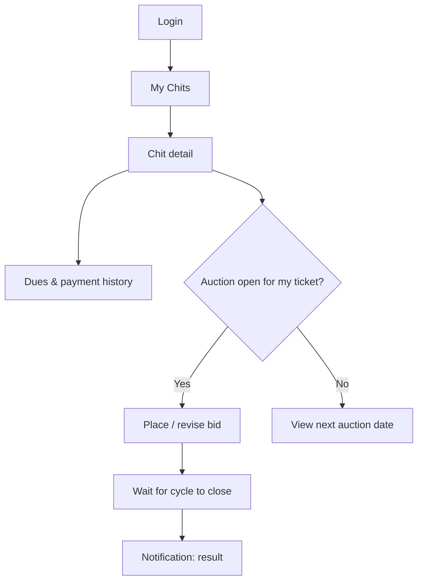
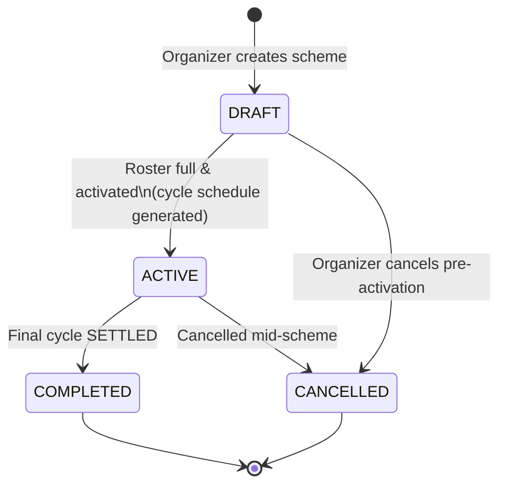
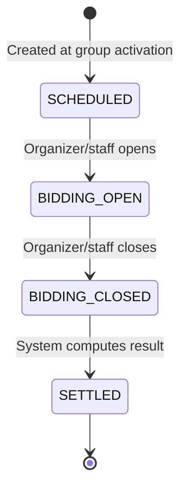
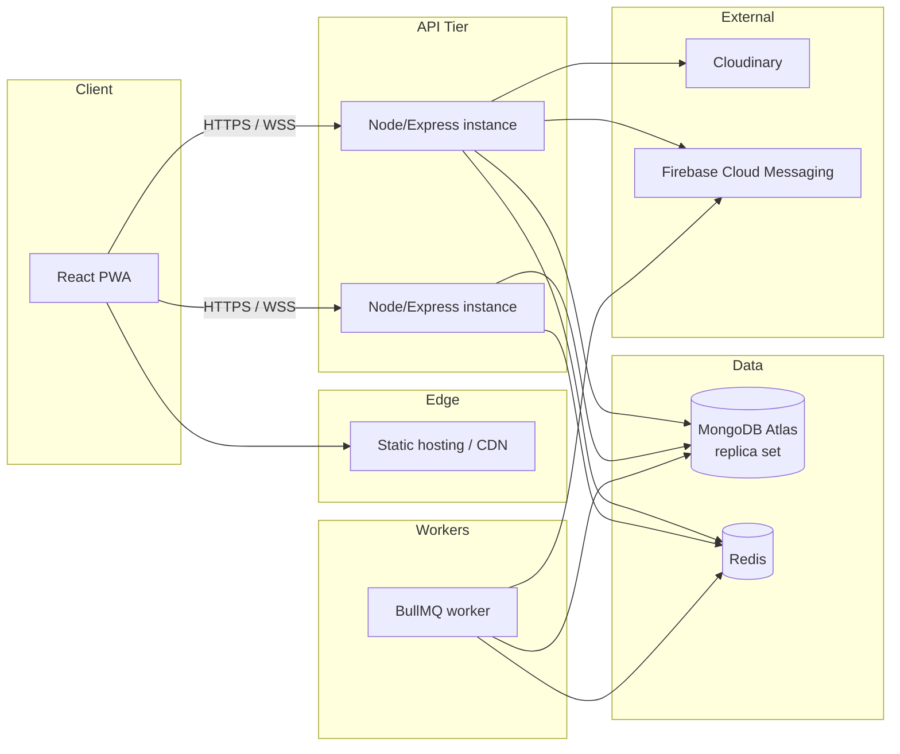
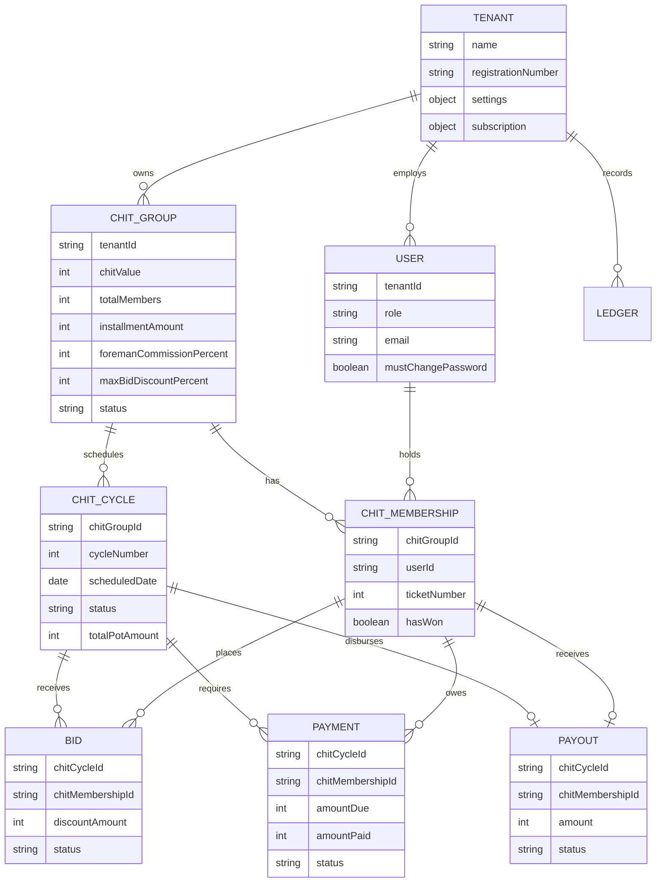

# KuriPro — Phase 1 Product & Architecture Blueprint

**Status:** Draft, pending approval. Nothing in this document has been implemented beyond what's noted as "Already built."
**Scope:** Product vision through deployment/scalability strategy. No application code.

This blueprint is the canonical reference for KuriPro going forward. Later phases should stay consistent with it; any deviation should be called out explicitly and explained, not made silently.

Sections marked **⚠ Needs your confirmation** describe a reasonable default I've chosen based on standard chit-fund practice, but which is a genuine business decision, not an engineering detail — flagged for your sign-off rather than assumed. They're also collected in one place at the end (§28).

---

## 1. Product Vision

KuriPro replaces the paper registers, Excel sheets, and WhatsApp coordination that most Indian chit fund (Kuri) companies run on today with a compliant, multi-tenant SaaS platform — without the cost or complexity of enterprise banking software.

For the **organizer (foreman)**, KuriPro is the system of record: scheme setup, member enrollment, auctions, collections, payouts, and commission — all statutorily compliant by construction, not by manual policy.

For the **member**, KuriPro is a transparent window into money they've committed to a scheme they don't control: what's due, when the next auction is, whether they've won, and where their payout stands.

For **field staff**, KuriPro is a fast, mobile-first collection tool that keeps working when the connection doesn't.

The product is a single installable PWA, so one deployment serves all three audiences behind role-based views — not three separate apps.

## 2. Functional Requirements

Grouped by area; ✅ = already built, ▢ = planned.

**Platform & tenancy**
- ✅ Organizer self-registration (creates Tenant + ORGANIZER user)
- ✅ JWT login / rotating refresh / logout / forced password change
- ▢ Tenant subscription plan management (trial → paid)
- ▢ Super-admin tenant oversight console

**People & access**
- ✅ Organizer creates STAFF and MEMBER accounts (temporary password, forced rotation)
- ✅ Role-based access control (SUPER_ADMIN / ORGANIZER / STAFF / MEMBER)
- ▢ KYC document capture and verification workflow

**Chit scheme management**
- ✅ Create a chit group (value, duration, commission %, discount cap — statutory fields included)
- ✅ Enroll members into tickets (auto or manual ticket numbers)
- ✅ Activate a group (locks roster, generates the full cycle schedule)
- ▢ Cancel / foreclose a scheme

**Auctions**
- ▢ Open a cycle for bidding
- ▢ Place / revise a bid (real-time, statutory cap enforced)
- ▢ Close bidding and determine the winner
- ▢ Settle a cycle (commission, dividend, prize calculation)

**Money**
- ▢ Record an installment collection (manual first; gateway later)
- ▢ Track overdue installments
- ▢ Record a payout disbursement
- ▢ Append-only ledger for every rupee movement
- ▢ Financial reports (per scheme, per member, per tenant)

**Communication**
- ▢ Due-date and auction reminders
- ▢ Win / payout notifications
- ▢ In-app real-time updates during a live auction

**Member self-service**
- ▢ "My chits" — dues, history, auction dates, win status

**Field operations**
- ▢ Offline-capable collection entry with background sync

## 3. Non-Functional Requirements

| Category | Requirement |
|---|---|
| Correctness | All money stored/computed as integer paise; multi-document writes that affect money use Mongo transactions |
| Security | TLS everywhere, bcrypt (cost 12) password hashing, short-lived JWT + rotating opaque refresh tokens, tenant-isolation defense-in-depth at the DB layer |
| Availability | 99.5% target for MVP (single region); architecture allows HA later without a rewrite |
| Performance | p95 API read latency < 300ms under normal load; bidding path must be race-free (no double-win) |
| Scalability | Stateless API tier, horizontally scalable; tenant-prefixed indexes support sharding later |
| Usability | Mobile-first, installable PWA; usable by low-tech-literacy field staff and members |
| Compliance | Chit Funds Act, 1982 constraints (registration numbers, configurable commission/discount caps) enforced in the data model, not just UI copy |
| Maintainability | TypeScript everywhere, feature-based modules, no framework-fighting shortcuts |
| Accessibility | WCAG AA target for member-facing screens |
| Offline tolerance | Field collection must degrade gracefully without connectivity, never silently lose or duplicate a payment |

## 4. User Personas

| Persona | Role | Profile |
|---|---|---|
| Rakesh, 45 | Organizer | Runs a licensed chit company, 5–10 active schemes. Moderate tech comfort, uses phone + laptop. The buyer. |
| Anitha, 28 | Staff / field collector | Visits members to collect cash installments. Needs speed over sophistication; often in low-connectivity areas. |
| Suresh, 50 | Member | Small business owner in 1–3 chits. Wants to know what's due, when the auction is, and whether he's won. Mobile-only, moderate-to-low tech comfort. |
| Divya | Platform super admin | KuriPro's own ops team — tenant onboarding, support, compliance monitoring. |

## 5. User Roles

| Role | Belongs to a tenant? | Summary |
|---|---|---|
| `SUPER_ADMIN` | No | Platform operator. Cross-tenant oversight, no scheme-level operations. |
| `ORGANIZER` | Yes (exactly one) | Tenant owner. Full control of their tenant: schemes, staff, members, money. |
| `STAFF` | Yes (exactly one) | Organizer's employee. Day-to-day operations (enrollment, collection, auctions) within the tenant, cannot manage other staff or tenant settings. |
| `MEMBER` | Yes (exactly one) | A chit subscriber. Self-service visibility and bidding on their own memberships only. |

*(One email = one tenant membership — see §11 Business Rules.)*

## 6. User Journeys

**Organizer onboarding → operating a scheme**
Sign up → set tenant details (commission/discount defaults, statutory registration) → create a chit group → enroll members → activate (roster locked, cycle schedule generated) → each month: open bidding → members bid → close bidding → system settles the cycle → staff record collections → organizer records the payout → repeat until the scheme completes.

**Member**
Invited by organizer → logs in with temp password → forced password change → sees assigned chits → sees dues and upcoming auction dates → participates in bidding when eligible → gets notified of a win → tracks payout → keeps paying installments until the scheme ends (winning early doesn't end their obligation — see §14).

**Staff (field collection)**
Invited → logs in → sees assigned members/collection targets → records a payment in the field (works offline, syncs later) → sees overdue list → flags a chronic defaulter to the organizer.

## 7. Navigation Structure

One PWA, role-aware navigation, not separate apps per role.

```
Organizer / Staff shell
├── Dashboard
├── Chit Groups
│   ├── Group Detail → Members → Cycles → Cycle Detail (bidding room)
├── Payments (collection queue, overdue)
├── Payouts
├── Ledger / Reports
├── Staff              (organizer only)
├── Notifications
└── Settings           (organizer only — tenant defaults, subscription)

Member shell
├── My Chits
├── Dues & Payment History
├── Auctions (view / bid when eligible)
├── Notifications
└── Profile

Super Admin shell
├── Tenants
├── Subscriptions
├── Support / Audit Logs
└── System Health
```

## 8. Complete Feature List

Same items as §2, flattened with build status — kept in one place so it doubles as the working backlog.

| # | Feature | Status |
|---|---|---|
| 1 | Organizer self-registration | ✅ Built |
| 2 | Login / refresh / logout / change-password | ✅ Built |
| 3 | Staff & member account creation (temp password) | ✅ Built |
| 4 | RBAC (4 roles) | ✅ Built |
| 5 | Chit group creation (statutory fields, divisibility check) | ✅ Built |
| 6 | Member enrollment (ticket assignment) | ✅ Built |
| 7 | Group activation + cycle schedule generation | ✅ Built |
| 8 | Tenant subscription/billing management | ▢ Planned |
| 9 | KYC capture & verification | ▢ Planned |
| 10 | Auction open/bid/close/settle engine | ▢ Planned |
| 11 | Live bidding UI (Socket.io) | ▢ Planned |
| 12 | Installment collection recording | ▢ Planned |
| 13 | Overdue detection & follow-up | ▢ Planned |
| 14 | Payout recording | ▢ Planned |
| 15 | Append-only ledger + financial reports | ▢ Planned |
| 16 | Notifications (push/email, due & auction reminders) | ▢ Planned |
| 17 | Member self-service portal | ▢ Planned |
| 18 | Offline collection entry + sync | ▢ Planned |
| 19 | Super-admin console | ▢ Planned |
| 20 | Scheme cancellation / foreclosure | ▢ Planned |

## 9. Information Architecture

Ownership hierarchy — everything under a `Tenant` is isolated from every other tenant (see §24 Security Architecture):

```
Tenant
├── Users (Organizer, Staff, Member)
├── ChitGroup
│   ├── ChitMembership (one per enrolled ticket)
│   └── ChitCycle (one per month, count = totalMembers)
│       ├── Bid (one or more per membership per cycle)
│       ├── Payment (one per membership per cycle — the installment)
│       └── Payout (one per cycle — the winner's disbursement)
└── Ledger (append-only, cross-cutting audit trail)
```

## 10. Screen Flow

**Organizer: scheme setup → first auction**



**Member: dues and bidding**



## 11. Business Rules

Already enforced in code:
- A `ChitGroup`'s `chitValue` must be **exactly divisible** by `totalMembers` — installments must sum precisely to the chit value, no rounding drift.
- The member roster is **locked once a group is `ACTIVE`** — no enrollment after activation.
- **One email = one tenant.** Login resolves by email before a tenant is known, so email is globally unique across the platform, not per-tenant. A person in two unrelated chit companies needs two emails. **⚠ Needs your confirmation** if this trade-off is acceptable long-term.
- `foremanCommissionPercent` and `maxBidDiscountPercent` are **snapshotted onto the group at creation** from tenant defaults — later tenant-setting changes never retroactively alter a running scheme.
- Every tenant-owned collection requires `tenantId` in its query filter at the database layer (not just application discipline) — see §24.
- Money is always an integer number of paise; never a float.
- The `Ledger` collection is append-only — entries are created, never updated or deleted.

Rules to formalize now for the upcoming auction/payment engine:
- A membership can **win at most once** per scheme.
- A bid's discount cannot exceed the group's `maxBidDiscountPercent`.
- Only one bid per membership counts per cycle — resubmitting marks the prior bid `WITHDRAWN`.
- **Winning a cycle does not end a member's obligation** — every active membership pays the fixed installment every cycle until the scheme completes, regardless of who has already won.
- A cycle's status only moves forward: `SCHEDULED → BIDDING_OPEN → BIDDING_CLOSED → SETTLED`, never backward, never skipped.

## 12. Chit Lifecycle



Mid-scheme cancellation needs a refund/reconciliation policy (who gets back what, how prior collections and any disbursed payouts are settled) — not yet designed. **⚠ Needs your confirmation** before the cancellation flow is built.

## 13. Auction Flow



Proposed settlement math (standard Kerala/Kuri auction model) — **⚠ Needs your confirmation**:

1. **Winning bid** = the highest-discount `ACTIVE` bid at close (ties broken by earliest `submittedAt`). Only memberships that haven't won before and are `ACTIVE` are eligible.
2. `discountAmount` = the winning bid's amount.
3. `commissionAmount` = `totalPotAmount × foremanCommissionPercent / 100`.
4. `dividendPool` = `discountAmount − commissionAmount`.
5. `dividendPerMember` = `dividendPool ÷ (totalMembers − 1)`, credited to every **other** active membership (not the winner).
6. `prizeAmount` = `totalPotAmount − discountAmount`, disbursed to the winner — **open question:** disbursed in full, or net of that member's own outstanding dues? Needs your call.
7. Winner's membership flips `hasWon = true`; group's `currentCycleNumber` advances; ledger entries recorded for commission and payout.

Auto-open/auto-close via a scheduled job vs. manual organizer action each cycle is also open — proposed default is **manual trigger for MVP**, automation as a later enhancement.

## 14. Payment Flow (Installments)

Independent of auction outcome — this is the core mechanic that funds the pot:

- At activation, one `Payment` row is implied per `ChitMembership` per `ChitCycle` (created when a cycle opens), `amountDue = installmentAmount`, `dueDate = cycle.scheduledDate`.
- Status: `PENDING → PARTIAL/PAID`, or `PENDING → OVERDUE` past due date (scheduled job).
- Manual recording only in this phase — method (`CASH`/`BANK_TRANSFER`/`UPI`/`CHEQUE`/`OTHER`), recorded by staff/organizer, optional receipt image.
- Every previous cycle's winner **keeps paying** the same installment every remaining cycle — winning only changes when they receive money, not what they owe.

## 15. Collection Flow

Field-operations view of §14:
- Staff see an assigned collection queue (by member, by due date).
- Payment recorded in person → optional photo/receipt upload (Cloudinary) → status updated.
- Works offline (see §25) — queued locally, synced when connectivity returns, using a client-generated idempotency key so a retried sync can never double-record the same payment.
- Repeated overdue → membership can be flagged `DEFAULTED`, surfaced to the organizer for follow-up. Whether a `DEFAULTED` member is barred from bidding is a rule to confirm. **⚠ Needs your confirmation**

## 16. Notification Flow

| Trigger | Audience | Channel |
|---|---|---|
| Account invited (temp password issued) | Staff/Member | In-person/manual today; email/SMS once integrated |
| Installment due (T-3, T-0, overdue) | Member | Push (Firebase), future SMS |
| Bidding opens on their ticket | Member | Push + in-app real-time (Socket.io) |
| Bidding closes / result | Member | Push |
| Payout disbursed | Member | Push |
| KYC status change | Member | Push |
| Collection assignment | Staff | In-app |

Delivery mechanics: scheduled/triggered jobs via BullMQ; live in-app updates while connected via Socket.io. SMS/email provider not yet chosen — see §23.

## 17. Permission Matrix

| Action | SUPER_ADMIN | ORGANIZER | STAFF | MEMBER |
|---|:---:|:---:|:---:|:---:|
| Register a tenant | — | Self only | — | — |
| Suspend/manage any tenant | ✅ | — | — | — |
| Edit tenant settings (commission/discount defaults) | ✅ any | ✅ own | — | — |
| Create STAFF account | — | ✅ | — | — |
| Create MEMBER account | — | ✅ | ✅ | — |
| List tenant users | ✅ any | ✅ own | ✅ own | — |
| Create / enroll / activate chit group | — | ✅ | ✅ | — |
| View chit group management screens | ✅ any | ✅ own | ✅ own | — |
| View own chit memberships & dues | — | — | — | ✅ own |
| Open / close bidding cycle | — | ✅ | ✅ | — |
| Place a bid | — | — | — | ✅ own membership |
| Record a collection | — | ✅ | ✅ | — |
| Record a payout | — | ✅ | ✅ | — |
| View ledger / financial reports | ✅ any | ✅ own | Limited own¹ | — |
| Change own password | ✅ | ✅ | ✅ | ✅ |

¹ Proposed: staff see collection-related entries, not full P&L/commission reporting. **⚠ Needs your confirmation**

## 18. Folder Structure

**Backend — already built, feature-based modules:**

```
backend/src/
├── config/          env.ts, db.ts, redis.ts, logger.ts, cloudinary.ts, firebase.ts
├── middleware/       error-handler.ts, jwt-auth.ts, rbac.ts, tenant-scope.plugin.ts, validate.ts
├── modules/
│   ├── auth/         controller, service, routes, validators, token.service
│   ├── tenants/       tenant.model
│   ├── users/         user.model, user.serializer, users.service/controller/routes/validators
│   ├── chit-groups/   chit-group.model, chit-membership.model, service, controller, routes, validators
│   ├── chit-cycles/   chit-cycle.model
│   ├── bids/          bid.model
│   ├── payments/      payment.model
│   ├── payouts/       payout.model
│   └── ledger/        ledger.model
├── sockets/           index.ts, socket-auth.ts, types.ts
├── types/             auth.ts, express.d.ts
├── utils/             app-error, common-validators, date, money, mongoose-helpers, pagination, password, slugify
├── app.ts
└── server.ts
```

**Frontend — proposed, not yet built:**

```
frontend/src/
├── app/               App shell, router, providers (React Query, auth context)
├── features/
│   ├── auth/
│   ├── chit-groups/
│   ├── auctions/       live bidding room UI
│   ├── payments/
│   ├── members/        member self-service views
│   └── admin/           tenant/staff management
├── components/
│   ├── ui/              shadcn/ui primitives
│   └── layout/          shell, nav, header
├── lib/                 API client, socket client, offline/IndexedDB helpers
├── hooks/
├── routes/              React Router definitions, role guards
├── pwa/                 service worker, manifest, offline queue
└── types/               shared DTOs mirroring the backend
```

## 19. API Structure

**Already built:**

```
POST   /api/auth/register-organizer
POST   /api/auth/login
POST   /api/auth/refresh
POST   /api/auth/change-password
POST   /api/auth/logout

POST   /api/users/members
POST   /api/users/staff
GET    /api/users

POST   /api/chit-groups
GET    /api/chit-groups
GET    /api/chit-groups/:id
POST   /api/chit-groups/:id/members
GET    /api/chit-groups/:id/members
POST   /api/chit-groups/:id/activate
GET    /api/chit-groups/:id/cycles
```

**Planned:**

```
GET    /api/chit-groups/:id/cycles/:cycleId
POST   /api/chit-groups/:id/cycles/:cycleId/open
GET    /api/chit-groups/:id/cycles/:cycleId/bids
POST   /api/chit-groups/:id/cycles/:cycleId/bids
POST   /api/chit-groups/:id/cycles/:cycleId/close

POST   /api/payments/:paymentId/record
GET    /api/payments?membershipId=&status=

POST   /api/payouts/:payoutId/disburse

GET    /api/ledger?...filters

GET    /api/me/chits
GET    /api/me/payments
GET    /api/notifications

WS     cycle:bid-placed / cycle:bidding-closed / cycle:settled
```

## 20. Deployment Architecture



Proposed (not yet provisioned): frontend on a static CDN host (Vercel/Netlify/S3+CloudFront); backend containerized (Docker) on a platform like Render/Railway/Fly.io/ECS; MongoDB Atlas (replica set — required for the transactions already in use); managed Redis (Upstash/ElastiCache); BullMQ workers as an independently-scaled process; CI/CD via GitHub Actions. **⚠ Needs your confirmation** on hosting provider choice.

## 21. ER Diagram



## 22. Database Relationships

- **1 Tenant → N Users, N ChitGroups, N Ledger entries.** All tenant-owned collections carry `tenantId`, enforced at query time by a Mongoose plugin (see §24).
- **1 ChitGroup → exactly `totalMembers` ChitMemberships and exactly `totalMembers` ChitCycles.** Both counts are fixed at creation and enforced (roster locked at activation; cycles generated once, atomically).
- **1 ChitCycle → N Bids, 1 Payout, N Payments** (one Payment per active membership in that cycle).
- **1 User → N ChitMemberships** (a member can hold more than one ticket, in the same or different groups).
- **Ledger is append-only** and references, but never depends on, the mutable Payment/Payout rows — it's the reconciliation source of truth independent of operational state changes.

## 23. Third-Party Integrations

| Integration | Purpose | Status |
|---|---|---|
| Cloudinary | KYC documents, payment receipts | Configured, no upload endpoint yet |
| Firebase (FCM) | Push notifications | Configured, no send path yet |
| Payment gateway (e.g. Razorpay) | Online collection | Deliberately deferred to a later phase (manual tracking first) |
| SMS provider | Due/auction reminders via SMS | **Not yet selected** — needed for a market where not every member has reliable push notifications |
| Transactional email | Receipts, invite emails | **Not yet selected** |

**⚠ Needs your confirmation:** SMS and email provider choice, before the notification module is built.

## 24. Security Architecture

- **Transport:** TLS everywhere in production; secure, `httpOnly`, `SameSite=strict` cookie for the refresh token; Bearer token (not a cookie) for the access token, which limits CSRF exposure on state-changing requests since browsers don't auto-attach it.
- **Passwords:** bcrypt, cost factor 12.
- **Tokens:** short-lived JWT access tokens (15 min default); opaque, Redis-backed, rotating refresh tokens — revocation is a key delete, not a JWT blocklist.
- **Tenant isolation (defense-in-depth):** a Mongoose plugin refuses to execute `find`/`update`/`delete` on any tenant-owned collection if the query filter is missing `tenantId` — a forgotten filter fails loudly instead of silently leaking one tenant's data to another. Application code still explicitly scopes every query; this is the safety net, not the mechanism.
- **RBAC:** enforced per-route via middleware, not left to the frontend.
- **Input validation:** Zod schemas at every request boundary (body, query, params).
- **Transport hardening:** Helmet security headers, rate limiting (global + a tighter limit on auth endpoints).
- **Logging:** structured logs (pino) with redaction of `password`, `passwordHash`, `refreshToken`, `authorization` header.
- **Auditability:** append-only Ledger for every financial event.
- **Compliance:** statutory registration numbers and configurable commission/discount caps are schema fields, enforced server-side, not just documented policy.

## 25. Offline Sync Strategy

PWA + IndexedDB, for field staff working in low-connectivity areas:

- **Read side:** essential reference data (assigned members, collection queue, due lists) cached locally so staff can see their work without connectivity.
- **Write side:** mutations made offline (recording a collection) are queued in IndexedDB with a client-generated idempotency key and a `pending-sync` status.
- **Sync:** on reconnect (Service Worker Background Sync where supported, manual reconciliation otherwise), queued mutations are replayed against the API. The server treats the idempotency key as a dedupe guard — a retried sync can never record the same payment twice.
- **Conflict resolution:** the server is always the source of truth. Because this is money, "last write wins" is not an acceptable strategy — a queued mutation is either accepted (idempotency key not seen before) or already-applied (key seen, no-op), never merged or overwritten.

## 26. Backup Strategy

- **MongoDB:** Atlas continuous backups / point-in-time recovery; daily snapshots retained 30 days (proposed). **⚠ Needs your confirmation** on retention window — the Chit Funds Act likely imposes a statutory financial-record retention period; I don't want to assert a specific number without your (or legal counsel's) confirmation.
- **Redis:** ephemeral by design — refresh tokens and job queue state, safe to lose (forces re-login / job retry), never the source of truth for business data.
- **Cloudinary:** relies on Cloudinary's own redundancy for uploaded media.
- **Ledger:** periodic export/archival for compliance, independent of the operational database backup.

## 27. Scalability Strategy

- API tier is stateless — horizontally scalable behind a load balancer.
- MongoDB indexes are already tenant-prefixed (`{ tenantId: 1, ... }`), which keeps the door open for sharding by `tenantId` later if a single tenant's data volume grows large (not expected to be necessary for a chit-fund workload, but the schema doesn't foreclose it).
- Redis backs shared session/queue state, enabling multiple API instances without sticky sessions.
- BullMQ workers scale independently of the API tier.
- Socket.io will need the Redis adapter once running more than one instance — not yet wired, flagged as a gap to close before horizontal scaling of the API tier.
- Read-heavy, rarely-changing data (tenant settings) is a candidate for a Redis cache-aside layer — not yet implemented.
- Static frontend assets served via CDN.

---

## 28. Open Decisions Requiring Your Approval

1. **§11** — Is "one email = one tenant" acceptable long-term, or do you need one person to belong to multiple tenants?
2. **§12** — Refund/reconciliation policy for a scheme cancelled mid-lifecycle.
3. **§13** — Confirm the settlement formula (dividend split, and whether a winner's prize nets against their own outstanding dues).
4. **§13** — Manual vs. automatic cycle open/close.
5. **§15** — Does a `DEFAULTED` membership get barred from bidding?
6. **§17** — Should STAFF see full financial reports, or collection-only?
7. **§20** — Hosting provider choice for frontend/backend/Mongo/Redis.
8. **§23** — SMS and transactional email provider selection.
9. **§26** — Statutory financial-record retention period.

Once these are resolved (or you're comfortable proceeding with the proposed defaults), the next phase would be the auction/settlement engine, since that's the only piece of the core chit mechanic not yet built.
