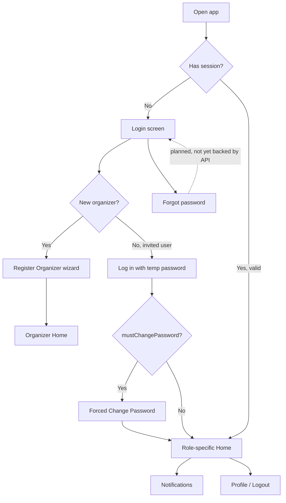
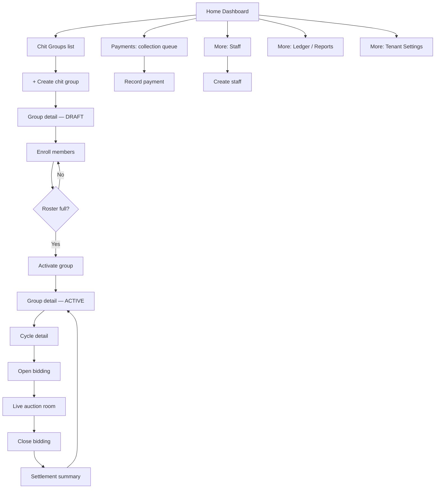
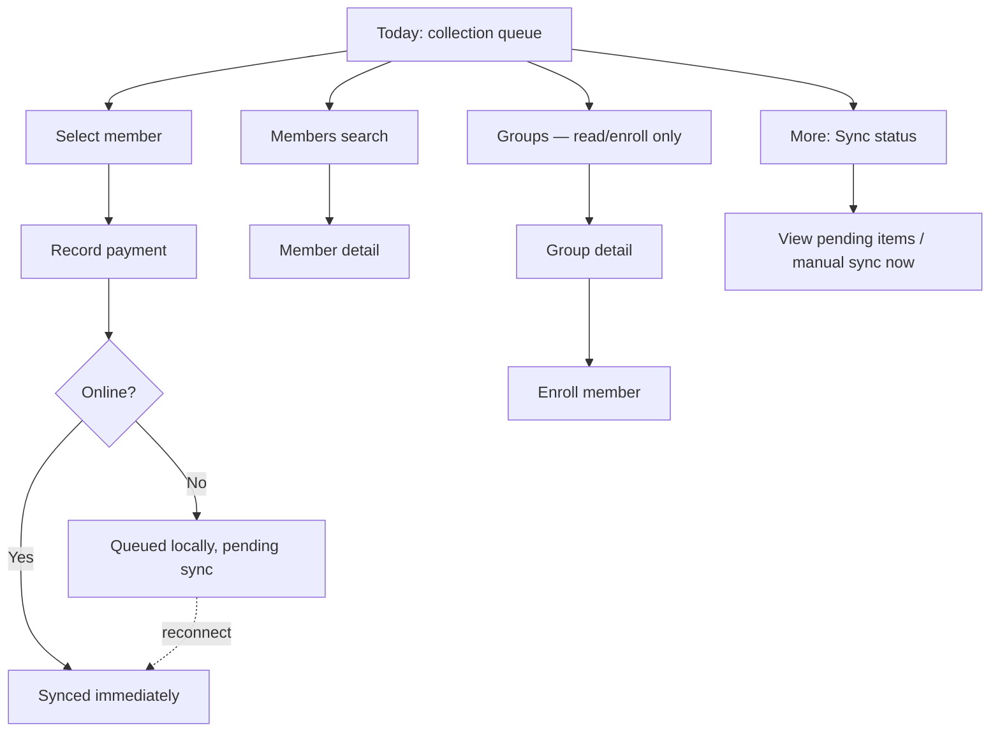
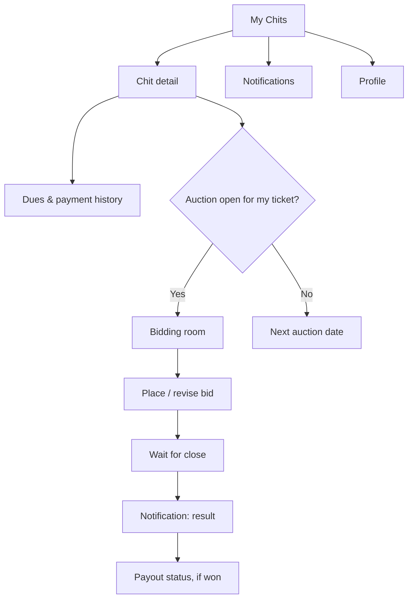

# KuriPro — Phase 2 UX Specification

**Status:** Draft, pending approval. No UI code in this phase — wireframes are low-fidelity structural sketches, not production markup.
**Scope:** Navigation, four user flows (User / Admin / Collection Agent / Member), mobile-first wireframes, complete inventories of pages/modals/bottom sheets/dialogs/reusable components, and the five system states (loading/empty/error/offline/success).
**Builds on:** `PHASE_1_BLUEPRINT.md`. Role names below map to the backend roles already implemented: **Admin = ORGANIZER**, **Collection Agent = STAFF**, **Member = MEMBER**. `SUPER_ADMIN` is out of scope for this pass (deferred, per your call).

---

## 1. UX Foundations

- **Mobile-first, single PWA.** One app, role-aware views — not three separate products. Designed for a 360–430px phone viewport first; tablet/desktop are progressive enhancements of the same information architecture, not redesigns.
- **Bottom tab navigation on mobile** (thumb-reachable, ≤5 destinations), **left rail on tablet/desktop** (≥768px) — same destinations, different chrome.
- **Touch targets ≥44×44px**, generous list-row height (≥56px) for field use with wet/gloved hands.
- **Offline-aware by default** for anything Staff touches in the field — never a blank screen with no explanation of *why* something failed.
- **Money is always shown formatted (₹) with tabular numerals**, never a raw integer/paise value in any UI surface.
- **Status is always encoded in form, not just words** — a colored pill/chip for every entity state (`DRAFT`/`ACTIVE`/…, `PENDING`/`OVERDUE`/…), so scanning a list communicates state without reading every row.

## 2. Navigation Design

### Admin (Organizer) — bottom tabs (mobile) / left rail (desktop)

```
[ Home ]  [ Groups ]  [ Payments ]  [ Auctions ]  [ More ]
```
- **Home** — dashboard: today's auctions, overdue summary, quick stats.
- **Groups** — chit group list → detail → members/cycles.
- **Payments** — collection queue, overdue list, record payment.
- **Auctions** — cross-group view of upcoming/live cycles (time-sensitive, deserves its own tab rather than being buried under Groups).
- **More** — Ledger/Reports, Staff, Members Directory, Notifications, Tenant Settings, Profile/Logout.

### Collection Agent (Staff) — bottom tabs

```
[ Today ]  [ Groups ]  [ Members ]  [ More ]
```
- **Today** — home screen, the assigned collection queue (due + overdue), sorted by urgency.
- **Groups** — read-only chit group browsing + member enrollment (staff can enroll, not activate/settle).
- **Members** — search across assigned members.
- **More** — Sync Status (offline queue), Notifications, Profile/Logout.

### Member — bottom tabs

```
[ My Chits ]  [ Dues ]  [ Auctions ]  [ Notifications ]
```
- Profile is a top-bar avatar tap, not a 5th tab — a member's destinations are shallow enough that a full tab would be wasted thumb-real-estate.

### Responsive rule

At ≥768px, each bottom tab bar becomes a persistent left sidebar and **"More" stops being a menu — its contents render as ordinary sidebar items.** No information is ever nested one level deeper on desktop than it is on mobile.

## 3. User Flow (shared, pre-role-branch)



## 4. Admin (Organizer) Flow



## 5. Collection Agent (Staff) Flow



## 6. Member Flow



## 7. Mobile-First Wireframes

Wireframed at representative-screen depth, not all 45 pages — the ten screens below cover every layout *pattern* in the product (list, detail, live/real-time, form, offline); every other page is a variation of one of these patterns. Full visual wireframes are in the companion artifact; this file lists what each covers.

1. **Login** — single-column form, email/password, "Forgot password" link (planned).
2. **Admin Home Dashboard** — stat tiles (today's auctions, overdue ₹, active groups) + today's action list.
3. **Chit Groups List** — card list, status pill per group, FAB to create.
4. **Chit Group Detail (ACTIVE)** — header stats + in-page tabs (Members / Cycles / Ledger).
5. **Enroll Member (bottom sheet)** — search existing member or quick-create, ticket number field.
6. **Live Auction Room** — current highest bid banner, countdown, bid list, place-bid CTA.
7. **Collection Queue (Staff, Today)** — grouped by Overdue/Due Today/Upcoming, offline banner variant.
8. **Record Payment (bottom sheet)** — amount, method chips, optional receipt photo.
9. **Member "My Chits" Home** — chit cards with next-due and hasWon indicators.
10. **Member Chit Detail** — dues list + upcoming auction card.

## 8. Complete Page List (45)

**Shared / Auth (6)**
1. Login
2. Register Organizer (wizard: Company → Address → Organizer account)
3. Forced Change Password
4. Forgot Password *(planned — no reset-via-email API yet)*
5. Notifications
6. Profile / Account Settings

**Admin — Organizer (27)**
7. Home Dashboard
8. Chit Groups List
9. Create Chit Group
10. Group Detail — DRAFT
11. Group Detail — ACTIVE
12. Group Detail — COMPLETED
13. Group Members List
14. Member Enrollment
15. Cycle Detail — SCHEDULED
16. Cycle Detail — BIDDING_OPEN (live room, admin controls)
17. Cycle Detail — BIDDING_CLOSED
18. Cycle Detail — SETTLED
19. Payments — Collection Queue
20. Payments — Overdue List
21. Payment Detail / Record Payment
22. Payouts — Pending List
23. Payout Detail / Disburse
24. Ledger — Tenant-wide
25. Ledger — Per-Group Report
26. Staff List
27. Create Staff
28. Staff Detail
29. Members Directory (tenant-wide)
30. Create Member
31. Member Detail (organizer's view)
32. Tenant Settings
33. Subscription / Billing *(planned)*

**Collection Agent — Staff (6)**
34. Today — Collection Queue
35. Members Search
36. Member Detail (staff view)
37. Groups (read-only)
38. Group Detail (staff view — enroll only)
39. Sync Status

**Member (6)**
40. My Chits
41. Chit Detail
42. Dues & Payment History
43. Auctions — Upcoming
44. Bidding Room
45. Payout Status

## 9. Complete Modal List

*(Heavier, multi-field or detailed-confirmation overlays — centered on desktop/tablet, full-screen takeover on mobile.)*

1. Create Chit Group
2. Create Staff / Create Member *(shows the generated temp password once, with copy-to-clipboard)*
3. Edit Tenant Settings
4. Activate Chit Group *(shows roster completeness + irreversibility warning — too much detail for a plain dialog)*
5. Cycle Settlement Summary *(commission/dividend/prize breakdown, confirm disburse)*
6. KYC Document Review *(planned)*
7. Cancel / Foreclose Chit Group *(planned — reason + refund detail)*

## 10. Complete Bottom Sheet List

*(Mobile-native slide-up panels for quick, low-friction actions.)*

1. Record Payment
2. Place Bid
3. Enroll Member (search existing / quick-create)
4. Filter / Sort (Groups, Payments, Auctions lists)
5. Payment Method Picker
6. Upload Receipt Photo (camera/gallery)
7. Share / Export Report
8. Notification Quick Actions

## 11. Complete Dialog List

*(Small, centered, 1–2 lines + 1–2 buttons.)*

1. Confirm Logout
2. Confirm Deactivate Staff/Member
3. Confirm Withdraw Bid
4. Confirm Close Bidding *(irreversible)*
5. Session Expired — re-login prompt
6. Discard Unsaved Changes
7. Generic Error Alert
8. Confirm Mark Payment as Waived

## 12. Reusable Components

| Component | Used for |
|---|---|
| App Shell | Top bar + bottom tab bar (mobile) / left rail (desktop) |
| Bottom Tab Bar | Primary navigation, mobile |
| Top App Bar | Page title, back button, contextual actions |
| Status Pill | Every entity status (group/cycle/payment/payout) |
| Stat Card / KPI Tile | Dashboard numbers |
| List Item | Generic row — icon/avatar, title, subtitle, trailing value |
| Group Card | Chit group summary in list view |
| Cycle Timeline / Stepper | `SCHEDULED → BIDDING_OPEN → BIDDING_CLOSED → SETTLED` |
| Money Display | Formatted ₹ with tabular numerals |
| Due Badge | "Due in 2 days" / "Overdue by 5 days" |
| Progress Bar | Roster fill (14/20 enrolled) |
| Avatar | Initials-based |
| Search Bar | All list screens |
| Filter Chip / Bar | List filtering |
| Empty State Block | See §14 |
| Error State Block | See §15 |
| Offline Banner | Persistent top banner when connectivity lost |
| Sync Status Indicator | Pending / syncing / synced |
| Toast / Snackbar | Transient confirmations |
| Skeleton Loader | List / card / detail shapes |
| Primary / Secondary / Destructive Button | All actions |
| Form Field | Label + input + helper/error text |
| Temp Password Display | Masked, with reveal + copy |
| Bottom Sheet Container | Drag handle + backdrop |
| Modal Container | Header + body + footer actions |
| Dialog Container | Title + message + actions |
| In-page Tab Bar | e.g. Group Detail's Members/Cycles/Ledger |
| FAB | "+ New Chit Group" on the Groups list |
| Receipt Thumbnail | Attachment preview |
| Notification List Item | Notifications screen |
| Bid Row | Live auction room — ticket #, amount, timestamp, winning highlight |
| Live Auction Banner | Current highest bid + countdown |
| Pull-to-refresh Indicator | All list screens |

## 13. Loading States

**Pattern:** skeleton screens (content-shaped placeholders) for anything that loads a list or detail page — never a bare spinner on its own for primary content. Spinners are reserved for button-level actions ("Activating…", "Placing bid…") and the initial session check.

Notable instances:
- **Live Auction Room:** "Connecting to live auction…" state while the Socket.io handshake completes, distinct from the data-loading skeleton.
- **Dashboard stat tiles:** skeleton bars in place of numbers, not a spinner over the whole page — the page shell (nav, header) renders immediately.
- **Settlement Summary:** an explicit "Calculating settlement…" state, since this involves a real (if brief) server computation, not just a fetch.

## 14. Empty States

Pattern: one-line illustration/icon + a sentence naming what's missing + (where applicable) a primary CTA that resolves it.

| Screen | Empty message | CTA |
|---|---|---|
| Chit Groups (Admin, new tenant) | "No chit groups yet" | + Create your first chit group |
| Collection Queue (Staff) | "All caught up — nothing due today" | — |
| My Chits (Member) | "You haven't been added to a chit yet" | "Ask your organizer to enroll you" (no CTA button — action isn't theirs to take) |
| Notifications | "Nothing here yet" | — |
| Auctions — Upcoming (Admin/Member) | "No auctions scheduled" | — |
| Search (any) | "No results for '…'" | Clear search |
| Staff List | "No staff added yet" | + Add staff |
| Ledger (new tenant) | "No transactions yet — they'll appear once collections start" | — |

## 15. Error States

- **Field-level:** inline, under the field, red text + red border — never a top-of-form summary alone.
- **Full-page load failure** (e.g., group detail failed to fetch): centered icon + "Couldn't load this page" + Retry button — the nav shell stays intact.
- **Toast for transient action failures:** "Something went wrong — please try again."
- **403 Forbidden** (role lacks permission for a deep-linked page): explains *why*, not a generic error — "You don't have access to this. Contact your organizer if you think that's wrong."
- **404 / gone** (deleted or nonexistent group): "This chit group no longer exists" + back to Groups.
- **Domain-specific rejections, shown inline, not as toasts** (they need to stay visible while the user corrects them):
  - Bid rejected — exceeds the group's max discount cap, or this membership already won.
  - Payment recording conflict — this installment was already marked paid (likely a double-submit or another staff member just recorded it).
  - Chit value / totalMembers not evenly divisible, on the Create Chit Group form.

## 16. Offline States

The defining state category for the Collection Agent flow:

- **Persistent offline banner** at the top of the shell the moment connectivity drops: "You're offline — new payments will be saved and synced automatically."
- **Queued-item indicator:** a small clock/sync icon on any list row representing an offline-recorded action, until it's confirmed synced.
- **Sync Status screen** (Staff → More): count of pending items, last successful sync time, manual "Sync now" button — visibility matters more than automation here, since staff need to trust the system when they can't see a network indicator.
- **Feature gating while offline:** anything inherently real-time (the Live Auction Room) shows "Bidding requires an internet connection" rather than a broken/stale UI — no silent degradation.
- **Reconnection toast:** "Back online — syncing 3 pending items…" followed by a success toast per §17 once each item lands, so the user doesn't have to go check the Sync Status screen to know it worked.
- **Idempotency is invisible to the user by design** — a payment recorded offline and synced later never appears twice, and the user never has to reason about retries themselves.

## 17. Success States

- **Toast/snackbar** for quick, low-stakes confirmations: "Payment recorded", "Member enrolled", "Group activated".
- **Full success screen** for milestones worth a moment of confirmation, not just a toast: organizer registration complete (welcome + "create your first chit group" CTA); chit group activated (roster locked, cycle schedule generated — shown as a summary, not just a toast); cycle settled (the Settlement Summary itself *is* the success state — no separate toast needed since the detail is the point).
- **Inline success:** a brief checkmark/highlight on the affected list row after an action, rather than only a toast that could be missed.
- **Copy confirmation:** explicit "Copied" feedback when an organizer copies a new staff/member's temporary password — this value is only shown once, so the confirmation needs to be unambiguous.

---

Everything above is a proposal awaiting your review — nothing here has been built. Once approved, wireframes for any of the 45 pages beyond the 10 covered here can be added before implementation starts.
