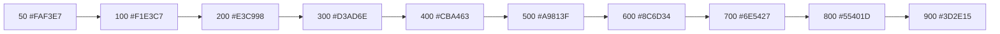

# KuriPro — Phase 3 Design System

**Status:** Draft, pending approval. No application code — this is a token specification and component inventory, structured to be rebuilt directly as a Figma library (Variables, Text Styles, Effect Styles, components).
**Builds on:** `PHASE_1_BLUEPRINT.md` (entities/enums) and `PHASE_2_UX_SPEC.md` (navigation, flows, screen inventory). Visual identity carries forward the "ledger & brass" direction already used in both prior documents — formalized here into a full token system, not just a document theme.

---

## 1. Color Palette

Two layers, matching how Figma Variables work: **Primitives** (raw ramps, one mode) feed **Semantic tokens** (Light/Dark modes, alias the primitives). Never use a primitive directly in a component — always through a semantic token, so theming is a mode switch, not a redesign.

### 1.1 Neutral ramp

One ramp, not two — light and dark themes are two different *readings* of the same ramp (dark theme uses the dark end for backgrounds, the light end for text; light theme the reverse). It drifts subtly warm-stone at the light end to cool-navy at the dark end, rather than flat gray — the same character already established in the Phase 1/2 documents, now formalized.

| Token | Hex | Notes |
|---|---|---|
| `neutral/0` | `#FFFFFF` | Pure white — light-theme elevated surfaces |
| `neutral/50` | `#F6F7F1` | = former "paper-card" |
| `neutral/100` | `#EDEFE7` | = former "paper" — light-theme app background |
| `neutral/200` | `#E0E3D8` | = former "paper-raised" |
| `neutral/300` | `#C7CBBC` | Borders, dividers (light) |
| `neutral/400` | `#A5AA9B` | Disabled text/icons (light) |
| `neutral/500` | `#82887E` | Placeholder text, mid-gray |
| `neutral/600` | `#656B67` | Secondary text (light) |
| `neutral/700` | `#4B5058` | Body text alternative / secondary text (dark theme) |
| `neutral/800` | `#30343C` | Elevated surfaces (dark) |
| `neutral/900` | `#1E212A` | Primary text (light theme) / surface (dark) |
| `neutral/950` | `#14171D` | Dark-theme app background |

### 1.2 Brand (Brass) ramp

| Token | Hex | Primary use |
|---|---|---|
| `brand/50`–`100` | `#FAF3E7` / `#F1E3C7` | Tinted backgrounds (selected row, info-adjacent banners) |
| `brand/400` | `#CBA463` | Dark-theme primary button fill, dark-theme links/icons |
| `brand/500` | `#A9813F` | Light-theme secondary accents |
| `brand/600` | `#8C6D34` | Light-theme links, icons, focus rings |
| `brand/700` | `#6E5427` | Light-theme primary button fill (darker, for AA contrast with white label text) |
| `brand/800`–`900` | `#55401D` / `#3D2E15` | Pressed states, text-on-tint |

### 1.3 Semantic ramps (success / warning / danger / info)

Four key stops each — sufficient for tints, borders, and solid fills; interpolate further in Figma if a component needs an in-between step.

| | 100 (tint bg) | 300 (border) | 500 (icon/solid) | 700 (text-on-tint) |
|---|---|---|---|---|
| **Success** (light) | `#E3EFE7` | `#8FBBA0` | `#3F6E52` | `#2C4E3A` |
| **Success** (dark) | `#1C2B23` | `#3F6E52` | `#74B48D` | `#A9D4BB` |
| **Warning** (light) | `#F2E5D8` | `#C99A6C` | `#8C5A2B` | `#5F3D1D` |
| **Warning** (dark) | `#2C2216` | `#8C5A2B` | `#D19A63` | `#E8C69C` |
| **Danger** (light) | `#F1DFDD` | `#C88E8B` | `#8C3230` | `#5F2321` |
| **Danger** (dark) | `#2B1D1C` | `#8C3230` | `#D18885` | `#E8B6B3` |
| **Info** (light) | `#DEE7EC` | `#7FA3B8` | `#3B5D7A` | `#28404F` |
| **Info** (dark) | `#1B242A` | `#3B5D7A` | `#7FAFCB` | `#B8D6E5` |

## 2. Light Theme (semantic tokens)

| Token | Value | Usage |
|---|---|---|
| `bg/app` | `neutral/100` | App background |
| `bg/surface` | `neutral/0` | Cards, sheets, inputs |
| `bg/surface-raised` | `neutral/50` | Nested panels within a surface |
| `bg/inverse` | `neutral/900` | Tooltips, inverse chips |
| `border/default` | `neutral/300` | Dividers, input borders |
| `border/strong` | `neutral/400` | Emphasized borders |
| `text/primary` | `neutral/900` | Body/heading text |
| `text/secondary` | `neutral/600` | Meta/caption text |
| `text/disabled` | `neutral/400` | Disabled labels |
| `text/on-brand` | `neutral/0` | Text on filled brand buttons |
| `icon/default` | `neutral/600` | Default icon fill |
| `accent/primary` | `brand/700` | Primary buttons, key CTAs |
| `accent/link` | `brand/600` | Links, secondary icons |
| `focus/ring` | `brand/600` @ 40% opacity | Focus-visible ring |

## 3. Dark Theme (semantic tokens)

| Token | Value | Usage |
|---|---|---|
| `bg/app` | `neutral/950` | App background |
| `bg/surface` | `neutral/900` | Cards, sheets, inputs |
| `bg/surface-raised` | `neutral/800` | Nested panels within a surface |
| `bg/inverse` | `neutral/50` | Tooltips, inverse chips |
| `border/default` | `neutral/800` (lightened to ~`rgba(233,231,223,0.16)`) | Dividers, input borders |
| `border/strong` | `rgba(233,231,223,0.28)` | Emphasized borders |
| `text/primary` | `neutral/50` | Body/heading text |
| `text/secondary` | `neutral/400` | Meta/caption text |
| `text/disabled` | `neutral/700` | Disabled labels |
| `text/on-brand` | `neutral/950` | Text on filled brand buttons (dark ink on light-gold fill) |
| `icon/default` | `neutral/400` | Default icon fill |
| `accent/primary` | `brand/400` | Primary buttons, key CTAs |
| `accent/link` | `brand/400` | Links, secondary icons |
| `focus/ring` | `brand/400` @ 45% opacity | Focus-visible ring |

## 4. Typography

**Two type families, deliberately** — this product is used on budget Android devices by low-tech-literacy field staff and members, so legibility wins over character for anything functional:

- **UI Sans** (`-apple-system, BlinkMacSystemFont, "Segoe UI", Roboto, "Helvetica Neue", Arial, sans-serif`) — every button, label, form field, table cell, nav item, and body paragraph. Roboto is the Android system font, so this stack renders natively (no font download) for most of the target market.
- **Display Serif** (`"Iowan Old Style", "Palatino Linotype", "URW Palladio L", Georgia, serif`) — used sparingly: large dashboard hero figures, report/ledger section headers, onboarding headline moments. Never on buttons, forms, tables, or nav.
- **Money is set in UI Sans with `font-variant-numeric: tabular-nums`** — not a monospace face. Monospace is reserved for genuinely technical strings (registration numbers, ticket/reference IDs).

| Token | Family | Size / Line-height | Weight | Use |
|---|---|---|---|---|
| `display/lg` | Serif | 40 / 48 | 700 | Rare — hero dashboard figure |
| `display/md` | Serif | 32 / 40 | 700 | Report section numbers |
| `heading/xl` | Sans | 28 / 36 | 700 | Page title (desktop) |
| `heading/lg` | Sans | 24 / 32 | 700 | Page title (mobile) / section header |
| `heading/md` | Sans | 20 / 28 | 600 | Card / modal title |
| `heading/sm` | Sans | 17 / 24 | 600 | List section header |
| `body/lg` | Sans | 16 / 24 | 400 | Primary body, list-item title |
| `body/md` | Sans | 15 / 22 | 400 | Default UI text |
| `body/sm` | Sans | 13 / 18 | 400 | Secondary/meta text |
| `caption` | Sans | 12 / 16 | 500 | Chip text, timestamps, field helper text |
| `overline` | Sans | 11 / 14, +0.06em tracking, uppercase | 600 | Table headers, section eyebrows |

## 5. Spacing

4px base unit, aligned to Tailwind's default scale (already the frontend's chosen framework) so translating tokens into utility classes is a 1:1 lookup, not a conversion.

| Token | Px | Typical use |
|---|---|---|
| `space/1` | 4 | Icon-to-label gap |
| `space/2` | 8 | Compact stack gap, chip padding |
| `space/3` | 12 | Form field internal padding |
| `space/4` | 16 | Default card padding, list-item padding |
| `space/5` | 20 | Section internal padding (desktop) |
| `space/6` | 24 | Section gap |
| `space/8` | 32 | Page section gap |
| `space/10` | 40 | Large section gap (desktop) |
| `space/12` | 48 | Page top padding (desktop) |
| `space/16` | 64 | Major layout gap (desktop) |

## 6. Radius

Restrained, not maximal — sharper for dense/tabular content, rounder for touch surfaces.

| Token | Px | Use |
|---|---|---|
| `radius/none` | 0 | Tables, dense data grids |
| `radius/xs` | 4 | Chips, badges, small controls |
| `radius/sm` | 8 | Buttons, inputs (default) |
| `radius/md` | 12 | Cards |
| `radius/lg` | 16 | Modals, larger cards |
| `radius/xl` | 24 | Bottom sheet top corners, hero cards |
| `radius/full` | 9999 | Avatars, pills, FAB |

## 7. Elevation

Semantic z-axis levels — what sits where, and why:

| Level | Used for |
|---|---|
| `elevation/0` | Page background, inline content |
| `elevation/1` | Resting cards (list items, stat tiles) |
| `elevation/2` | Raised (dropdown menus, popovers, sticky headers) |
| `elevation/3` | Overlays (bottom sheets, side drawers) |
| `elevation/4` | Modals / dialogs (+ backdrop dim) |
| `elevation/5` | Toasts (float above everything, including modals) |

## 8. Shadows

Concrete values per elevation level. Dark theme shadows alone don't read on a dark background, so each dark-theme level pairs a shadow with a faint 1px light border for separation, rather than relying on shadow depth alone.

| Level | Light | Dark |
|---|---|---|
| 1 | `0 1px 2px rgba(24,28,34,.08)` | `0 1px 2px rgba(0,0,0,.30)` + border `rgba(255,255,255,.06)` |
| 2 | `0 2px 6px rgba(24,28,34,.10)` | `0 2px 8px rgba(0,0,0,.40)` + border `rgba(255,255,255,.08)` |
| 3 | `0 4px 12px rgba(24,28,34,.12)` | `0 6px 16px rgba(0,0,0,.50)` + border `rgba(255,255,255,.08)` |
| 4 | `0 12px 32px rgba(24,28,34,.18)` | `0 16px 40px rgba(0,0,0,.60)` + border `rgba(255,255,255,.10)` |
| 5 | `0 8px 24px rgba(24,28,34,.20)` | `0 10px 28px rgba(0,0,0,.55)` |

## 9. Icons

**Lucide** — the correct default given shadcn/ui is already the component library: same author ecosystem, MIT license, consistent 24×24 grid, stroke-based (matches the restrained, non-decorative visual language here).

- Default stroke width: 1.75 (2 at 16px size, for legibility at small scale).
- Sizes: 16px (inline with caption text), 20px (dense UI — table row actions, form field adornments), 24px (nav, empty-state illustrations, section headers).
- **Icons are never the sole label for primary navigation** — always icon + text, given the audience. Icon-only is acceptable only for secondary, well-understood actions (close ×, back ←) inside a component that already has a text title.

## 10. Animation

| Token | Duration | Use |
|---|---|---|
| `duration/instant` | 100ms | Checkbox/switch toggle |
| `duration/fast` | 150ms | Hover states |
| `duration/base` | 200ms | Standard transitions (tab switch, chip color change) |
| `duration/slow` | 300ms | Modal/sheet enter |
| `duration/slower` | 450ms | Skeleton shimmer sweep (see §22) |

| Easing | Curve | Use |
|---|---|---|
| `ease/standard` | `cubic-bezier(.2,0,0,1)` | Most transitions |
| `ease/decelerate` | `cubic-bezier(0,0,0,1)` | Entrances (arriving content slows into place) |
| `ease/accelerate` | `cubic-bezier(.3,0,1,1)` | Exits (leaving content speeds away) |

Notable component motion:
- **Bottom sheet:** slide up 300ms `ease/decelerate` (enter), slide down 200ms `ease/accelerate` (exit); backdrop fades 200ms.
- **Toast:** slide + fade in 200ms `ease/decelerate` from the bottom; auto-dismiss after 4s (success/info); swipe-to-dismiss.
- **Dialog/Modal:** scale 0.96→1 + fade, 200ms `ease/decelerate` enter; fade-only 150ms exit.
- **Live auction bid row:** new bid slides in from top, 200ms `ease/decelerate`, then a background highlight fades out over 800ms.
- **Status chip change** (e.g. a bid becomes "Winning"): 150ms color crossfade + a brief 1→1.05→1 scale pulse over 300ms.
- **`prefers-reduced-motion` collapses all of the above to opacity-only or instant** — non-negotiable, not an afterthought.

## 11–25. Components

### 11. Buttons

- **Variants:** Primary (filled brand), Secondary (filled neutral), Outline (bordered), Ghost (text-only), Destructive (filled danger), Link (underline on hover).
- **Sizes:** sm (32px), md (40px, default), lg (48px — primary mobile CTA, matches the 44px+ touch target).
- **States:** default, hover (desktop only), pressed, focus-visible (visible ring — never suppressed), disabled (reduced opacity, no pointer events), loading (inline spinner, button disabled).
- **Anatomy:** optional leading icon → label → optional trailing icon / loading spinner.
- **Figma structure:** one component set. Variant properties `Type` × `Size` × `State`; boolean properties `Icon Left`, `Icon Right`.

### 12. Cards

- **Variants:** Static (elevation/1), Interactive (elevation/1 → elevation/2 on hover, used for Group Cards/list rows), Stat/KPI tile (compact, big number + caption label), Outlined (border only, no shadow — used *inside* an already-elevated container to avoid shadow-on-shadow).
- **Anatomy:** optional media/icon slot → header (title + optional trailing status chip) → body → optional footer (actions/metadata).
- **Padding:** `space/4` (mobile default), `space/5`–`space/6` (desktop).

### 13. Inputs

- **Types:** Text, Number/Currency (₹ leading adornment, tabular-nums), Textarea, Select, Search, Checkbox, Radio, Switch.
- **States:** default, focus (`accent/primary` ring), filled, error (`danger` border + helper text + icon), disabled, read-only.
- **Anatomy:** always-visible label above the field (never placeholder-only — an accessibility requirement for this audience) → input → helper/error text below → optional leading/trailing icon.
- **Height:** 44px default (a direct touch-target match); a 36px compact variant exists only for dense desktop filter bars.

### 14. Tables

- **Anatomy:** header row (labels, optional sort indicator) → body rows (hover-highlight, not zebra striping — status chips already carry the visual weight a striped table would add) → footer (pagination).
- **Row states:** default, hover, selected.
- **System states:** loading (skeleton rows), empty (full-width empty-state block), error (inline error block) — see §14/§15/§16 of the UX spec for the copy.
- **Responsive rule:** below `md` (768px), a table becomes a **stacked card list** (one card per row, label:value pairs) — never a horizontal-scrolling table, a well-known mobile anti-pattern for this audience.

### 15. Bottom Navigation

- **Anatomy:** fixed container with `safe-area-inset-bottom` padding (iOS home indicator) → 4–5 tab items, each icon (24px) + label (`caption`) + optional badge.
- **Active state:** icon + label shift to `accent/primary` — no moving pill/underline, since tab count varies by role (Admin 5, Staff 4, Member 4) and a fixed-position indicator would need per-role tuning for no real benefit.
- **Height:** 56px content + safe-area inset.

### 16. Sidebar (≥768px)

- **Anatomy:** brand mark → flat nav item list (icon + label; mobile's "More" items un-nest into ordinary rows here) → footer user card (avatar + name/role + logout).
- **Active state:** left accent bar + tinted background (`brand/50`/dark equivalent) + brand-colored icon/label.
- **Width:** 240px expanded / 64px icon-only collapsed (collapse is a nice-to-have, not required for MVP).

### 17. Charts

- **Library:** Recharts — pairs natively with shadcn/ui's chart primitives.
- **Chart types:** Line (collection trend over cycles), Bar (per-group/per-staff comparison), Sparkline (inline in stat tiles — no axes, just shape + emphasized endpoint dot), Donut (used sparingly — collected vs. outstanding split only; generally the weakest chart type for anything else).
- **Color rules:** categorical series draw from the brand ramp + info + one or two extended hues, in a fixed sequence — never a charting-library default rainbow. Semantic comparisons (paid vs. overdue) use `success`/`danger` directly, not arbitrary palette color. Sequential/heat data uses a single-hue ramp (light→dark on one color).
- **Chrome:** faint gridlines (`neutral/200` light / `neutral/800` dark), `caption`-style axis labels, tooltips styled as an `elevation/2` Card, currency-formatted money axes.

### 18. Toast

- **Anatomy:** semantic-colored icon + message + optional single action link + dismiss (×) — never more than one action.
- **Variants:** success / error / warning / info.
- **Position:** bottom-center, mobile (above the bottom nav, safe-area aware); bottom-right, desktop.
- **Behavior:** auto-dismiss 4s for success/info; **persists until dismissed for error** (errors need to be read and acted on, not glanced at); stacks up to 3, newest on top; swipe-to-dismiss on mobile.

### 19. Dialog

- **Anatomy:** optional severity icon → title (`heading/md`) → message (`body/md`, 1–3 lines) → action row, max 2 buttons (primary + secondary/cancel; a destructive confirmation uses the Destructive button variant).
- **Width:** ~320px mobile (near full-width with margin), 400px desktop, centered.
- **Backdrop:** plain dim overlay, no blur — blur is expensive to render on the budget Android hardware this product targets; a deliberate performance choice, not an oversight.

### 20. Bottom Sheet

- **Anatomy:** drag handle (small centered pill) → optional header (title + ×) → scrollable body → sticky footer (primary action; an elevation separator line appears once the body scrolls under it).
- **Snap points:** partial (content-height, default), full-height (longer mobile forms, e.g. Create Chit Group).
- **Dismissal:** drag-down or backdrop tap — **except** mid-edit on a form with unsaved changes, where the "Discard Unsaved Changes" Dialog (Phase 2, §11) intercepts the dismissal instead of losing input silently.

### 21. Date Picker

- **Trigger:** an Input-styled field showing the formatted date; tapping opens the picker.
- **Presentation:** bottom sheet on mobile (calendar grid + "Today" shortcut + Confirm), popover on desktop (≥`md`).
- **Variants:** single date (chit start date, KYC document date) and range (Ledger/report filtering — two-tap: start then end, connected in-range days shown filled).
- **States:** selected (brand fill), today (brand outline, unselected), disabled/out-of-range (muted, non-interactive — e.g. a chit start date can't be set in the past).

### 22. Avatar

- **Sizes:** xs (20px, dense lists), sm (24px), md (32px, default list rows), lg (48px, detail headers), xl (64px, profile page).
- **Fallback:** initials on a deterministic tint derived from a hash of the name across a small set of brand/semantic hues — the same person always renders the same color. This is the primary presentation, not a last-resort fallback, since photo upload isn't assumed for most members.
- **Overlay slot:** reserved bottom-right badge, used today for a KYC-verified checkmark, available later for presence indicators.
- **Group/stacked variant:** overlapping avatars + a "+N" overflow chip, for "N members" summaries.

### 23. Badges

Distinct from Status Chips (§24): badges are small **count/attention** indicators, not entity states.

- **Variants:** Dot (no number — "something's new"), Numeric (count, caps at "9+").
- **Placement:** top-right overlay on an icon (notification bell, Sync Status entry).

### 24. Status Chips

The full enum → chip-color mapping, tied directly to the backend schemas already built:

| Entity | Value | Chip color |
|---|---|---|
| **ChitGroup** | DRAFT | neutral |
| | ACTIVE | success |
| | COMPLETED | info |
| | CANCELLED | danger |
| **ChitCycle** | SCHEDULED | neutral |
| | BIDDING_OPEN | brand *(the one state that demands action — earns the accent color)* |
| | BIDDING_CLOSED | warning |
| | SETTLED | success |
| **Payment** | PENDING | neutral |
| | PARTIAL | warning |
| | PAID | success |
| | OVERDUE | danger |
| | WAIVED | info |
| **Payout** | PENDING | neutral |
| | DISBURSED | success |
| | FAILED | danger |
| **ChitMembership** | ACTIVE | success |
| | DEFAULTED | danger |
| | EXITED | neutral |
| **User** | ACTIVE | success |
| | INVITED | warning |
| | SUSPENDED | danger |
| **Bid** | ACTIVE | info |
| | WITHDRAWN | neutral |
| | WINNING | brand |
| | LOST | neutral |
| **KYC** | NOT_SUBMITTED | neutral |
| | PENDING | warning |
| | VERIFIED | success |
| | REJECTED | danger |
| **Tenant** | ACTIVE | success |
| | SUSPENDED | danger |
| **Subscription** | TRIALING | info |
| | ACTIVE | success |
| | PAST_DUE | warning |
| | CANCELLED | danger |

### 25. Skeleton Loaders

- **Shapes:** text-line (height matches the type-scale row it replaces), avatar-circle, card-block, table-row.
- **Animation:** a lighter gradient band sweeping left→right over the base fill, 1.5s linear infinite (`neutral/200` base / `neutral/100` sweep, light; `neutral/800` base / `neutral/700` sweep, dark). Under `prefers-reduced-motion`, this collapses to a static opacity pulse (0.6↔1, 1.5s) instead of a moving sweep.

## 26. Responsive Breakpoints

Aligned to Tailwind's default scale — the same numbers the frontend will actually use, not a parallel design-only scale.

| Breakpoint | Width | What changes |
|---|---|---|
| base | 0–639px | Phone. Bottom nav, single column, all overlays are bottom sheets. |
| `sm` | 640px | Large phone / small tablet — mostly unchanged, minor spacing increase. |
| `md` | 768px | **Nav switches to sidebar** (the exact threshold set in Phase 2). Modals become centered instead of full-screen. Date pickers become popovers instead of sheets. Two-column layouts appear. |
| `lg` | 1024px | Max content width introduced (~960–1100px, centered). Dashboards move to 3–4 column stat grids. |
| `xl` / `2xl` | 1280 / 1536px | Breathing room only — no structural change beyond `lg`. |

## 27. Figma-Readiness Map

How this document becomes a Figma library, section by section:

- **Variables → Collection "Primitives"**: one mode, containing §1's Neutral/Brand/Success/Warning/Danger/Info ramps as color variables (`color/neutral/100`, `color/brand/600`, …).
- **Variables → Collection "Semantic"**: two modes, **Light** and **Dark**, each variable (`bg/app`, `text/primary`, `accent/primary`, …) aliased to a Primitives step per §2/§3. Every component binds to Semantic, never Primitives directly — switching the collection's mode re-themes the whole file.
- **Text Styles**: one per §4 row, named to match exactly (`Display/LG`, `Heading/XL` … `Overline`), so a designer's Figma styles panel reads identically to this document.
- **Effect Styles**: one per §8 shadow level per theme (`Elevation/1`, … `Elevation/5`, duplicated for dark since Figma effect-style colors aren't mode-variable-bound the way fills are — a known Figma limitation, not an oversight here).
- **Grid/Spacing**: §5 as auto-layout gap presets / a documented spacing scale (Figma doesn't have first-class "spacing variables" applied automatically, but number variables named `space/4` etc. keep it consistent when set manually).
- **Radius**: §6 as corner-radius variables, bound directly on components (Figma does support variable-bound corner radius).
- **File pages:**
  1. **Foundations** — color ramps, type specimen, spacing ruler, radius/shadow samples, icon grid.
  2. **Components** — one frame per §11–25 item, built as a variant set with the states/sizes listed.
  3. **Patterns** — the loading/empty/error/offline/success compositions from Phase 2, §13–17.
  4. **Screens** — the 10 Phase 2 wireframes rebuilt at full fidelity using this system, then the remaining 35 pages as they're needed.

---

Nothing in this document has been implemented. Once approved, the natural next step is building out the Figma file itself, or — if you'd rather skip straight past Figma — starting frontend implementation directly against these tokens (Tailwind config + shadcn/ui theme).
