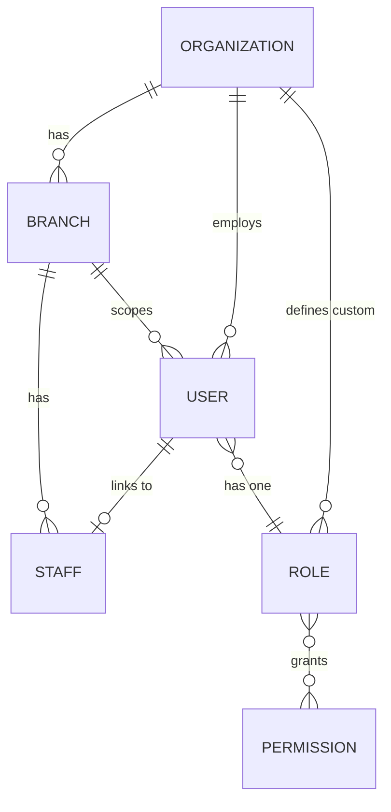
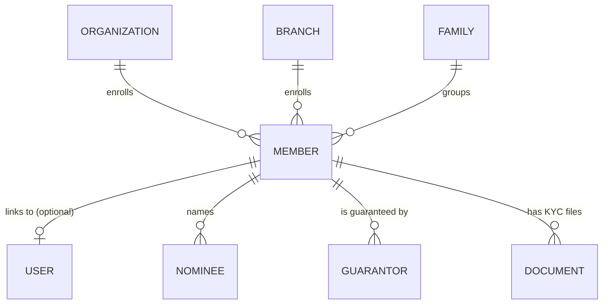
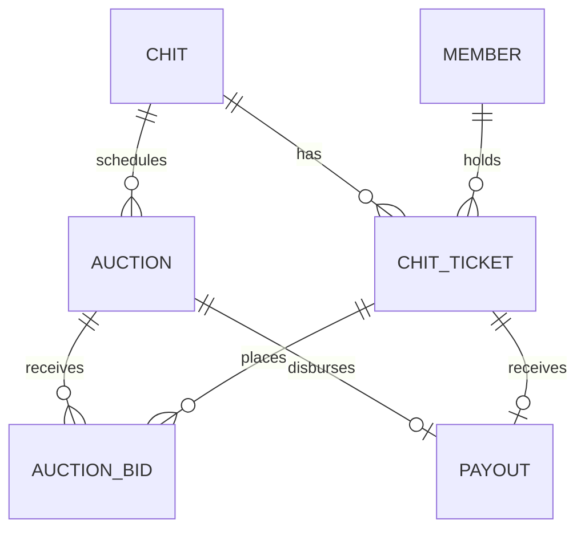
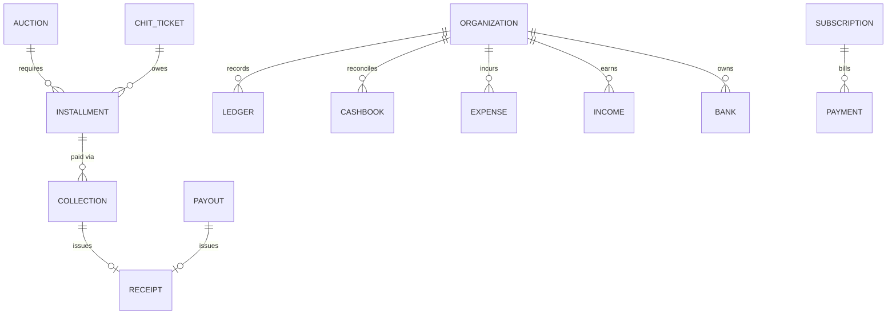

# KuriPro — Phase 4 Database Design

**Status:** Draft, pending approval. Schema/design specification only — no Mongoose models, no backend code.
**Builds on:** Phase 1 Blueprint (original 9-model schema), reconciled below. Confirmed direction: real Branch hierarchy, dynamic DB-driven RBAC, Member as a profile distinct from User, and a fuller accounting model (Installment/Collection split, Cashbook/Expenses/Income additive to Ledger).

---

## 0. Reconciliation With Phase 1

| Phase 1 | Phase 4 | Change |
|---|---|---|
| `Tenant` | `Organization` | Renamed. `tenantId` field → `organizationId` everywhere. |
| `ChitGroup` | `Chit` | Renamed, +`branchId` |
| `ChitMembership` | `ChitTicket` | Renamed (not in your list — structurally required as the Member↔Chit join; flagged, not dropped) |
| `ChitCycle` | `Auction` | Renamed |
| `Bid` | `AuctionBid` | Renamed |
| `Payment` | `Installment` + `Collection` | **Split.** `Installment` = the due schedule (what `Payment` was). `Collection` = a new transaction log against an installment — supports real partial payments instead of mutating one `amountPaid` field. |
| `User.role` (enum) | `User.roleId` → `Role`/`Permission` | Hardcoded 4-role enum replaced by DB-driven RBAC. Migration note in §3. |
| `Tenant.subscription` (embedded) | `Subscription` (collection) | Promoted to a top-level collection — billing history, not just current state. |
| `User.kyc.documents` (embedded) | `Document` (collection) | Promoted — KYC/receipt files now a polymorphic top-level collection. |
| `Ledger` | `Ledger` | **Unchanged** — still the immutable audit trail of chit-scheme money movements. `Cashbook`/`Expenses`/`Income` are additive, not replacements. |
| *(none)* | `Organization`, `Branch`, `Staff`, `Role`, `Permission`, `Member`, `Nominee`, `Guarantor`, `Family`, `Payment` (new domain), `Expense`, `Income`, `Cashbook`, `Bank`, `Notification`, `Document`, `Receipt`, `AuditLog`, `Settings`, `OTP`, `RefreshToken` (Mongo), `ActivityLog`, `Subscription` | New collections |

## 1. Cross-Cutting Conventions

Every collection below follows these unless explicitly noted.

**Standard audit fields:**
```
createdAt: Date
updatedAt: Date
createdBy: ObjectId ref User (nullable — system-generated records)
updatedBy: ObjectId ref User (nullable)
```

**Tenant scoping:** every organization-owned collection carries `organizationId`, enforced at the DB layer by the same tenant-scope Mongoose plugin already built in Phase 1 (refuses to execute an unscoped query). Platform-global collections (`Permission` catalog, `Settings` with `organizationId: null` for defaults) are the explicit exceptions.

**Soft delete — three different patterns, chosen deliberately per collection type, not one blanket flag:**

| Pattern | Fields | Used for |
|---|---|---|
| **Soft-delete flag** | `isDeleted`, `deletedAt`, `deletedBy` | Business entities where "undo" and historical reference matter: `Organization`, `Branch`, `Staff`, `Member`, `Nominee`, `Guarantor`, `Family`, `Chit`, `Bank`, `Document`, `Role` |
| **Status-based cancellation** | a `VOIDED`/`CANCELLED` status value, no delete at all | Financial records, where a record disappearing (even "soft") is worse than a visibly voided one: `Installment`, `Payment`, `Expense`, `Income`, `Subscription` |
| **True immutability** | no delete, no status-void — a correction is a *new* record referencing the old one | `Ledger`, `AuditLog`, `ActivityLog`, `Collection` (reversed via a new `REVERSED`-marked entry, not mutated), `AuctionBid` (revised via a new bid + old one `WITHDRAWN`), `Receipt` |
| **Hard delete / TTL** | actually removed | `Notification` (optional TTL purge), `OTP` (TTL + single-use), `RefreshToken` session records (TTL) |

**Versioning:** Mongoose's `__v` optimistic-concurrency key is kept on every mutable document (guards concurrent edits — e.g., two `Collection` entries landing on the same `Installment` at once). Full historical audit trails are **not** embedded arrays on each document — that's what `AuditLog` is for (structured before/after diffs, queryable independently, no unbounded array growth on the source document).

## 2. Cluster A — Identity & Access

### Organization
*(renamed Tenant — same shape as Phase 1, `+subscriptionId` reference)*

| Field | Type | Notes |
|---|---|---|
| name, slug, registrationNumber | String | slug unique |
| contactEmail, contactPhone, address | String / Address | |
| settings | Object | `defaultForemanCommissionPercent`, `defaultMaxBidDiscountPercent`, `currency` |
| status | Enum | `ACTIVE`, `SUSPENDED` |

**Relationships:** 1—N `Branch`, `User`, `Chit`; 1—N `Subscription` (history; latest = current).

### Branch *(new)*

| Field | Type | Notes |
|---|---|---|
| organizationId | ObjectId | required |
| name, code | String | `code` unique per organization |
| address | Address | |
| managerId | ObjectId ref Staff | nullable |
| status | Enum | `ACTIVE`, `INACTIVE` |

**Relationships:** Organization 1—N Branch; Branch 1—N `Staff`, `Member`, `Chit` (a Chit may be branch-scoped or org-wide — `branchId` nullable on `Chit`).

### User *(slimmed — auth identity only, business data now lives in Staff/Member)*

| Field | Type | Notes |
|---|---|---|
| organizationId | ObjectId | null only for `SUPER_ADMIN` |
| branchId | ObjectId | nullable — HQ/all-branches if null |
| roleId | ObjectId ref Role | replaces the old hardcoded enum |
| linkedProfileType | Enum | `STAFF`, `MEMBER`, `null` |
| linkedProfileId | ObjectId | polymorphic — points at Staff or Member |
| name, email, phone | String | **email globally unique** (unchanged from Phase 1 — login resolves before tenant is known) |
| passwordHash | String | `select: false` |
| mustChangePassword | Boolean | |
| status | Enum | `ACTIVE`, `INVITED`, `SUSPENDED` |
| lastLoginAt | Date | |

**Migration note:** existing `User.role` string values map 1:1 to four seeded system `Role` documents (`isSystemRole: true`) at migration time — no behavior change until an organization actually creates a custom role.

### Staff *(new — business profile for ORGANIZER/STAFF users)*

| Field | Type | Notes |
|---|---|---|
| organizationId, branchId | ObjectId | branchId nullable = HQ |
| userId | ObjectId ref User | unique — 1:1 |
| employeeCode | String | org-scoped |
| name, phone, email | String | denormalized for display/search; User remains source of truth |
| designation | String | e.g. "Field Collector", "Branch Manager" |
| joiningDate | Date | |
| status | Enum | `ACTIVE`, `INACTIVE`, `TERMINATED` |

### Role *(new — dynamic RBAC)*

| Field | Type | Notes |
|---|---|---|
| organizationId | ObjectId | **nullable** — null = system template (the 4 built-in roles) |
| name | String | unique per organization (or globally, if system) |
| isSystemRole | Boolean | protects the 4 built-ins from deletion |
| permissionKeys | [String] | references `Permission.key` — a stable string key, not an ObjectId (permissions are a fixed vocabulary; a natural key avoids populate overhead for a rarely-changing catalog) |

### Permission *(new — static catalog, global, no organizationId)*

| Field | Type | Notes |
|---|---|---|
| key | String | unique, e.g. `chit.create`, `payment.record`, `ledger.view_all` |
| label, category | String | UI grouping |
| isSystemPermission | Boolean | always true — platform-seeded, not organization-editable |

## 3. Cluster B — Members & KYC

### Member *(new — separate business profile, linked to User only once invited)*

| Field | Type | Notes |
|---|---|---|
| organizationId, branchId | ObjectId | |
| userId | ObjectId ref User | **nullable** — set only once invited/activated |
| memberCode | String | org-scoped, human-readable (`MEM-0042`) |
| name, phone, email | String | email optional here (required only on the linked User) |
| dateOfBirth, gender | Date / Enum | optional |
| address | Address | |
| kycStatus | Enum | `NOT_SUBMITTED`, `PENDING`, `VERIFIED`, `REJECTED` — actual files live in `Document`, not embedded |
| familyId | ObjectId ref Family | nullable |
| status | Enum | `ACTIVE`, `INACTIVE`, `BLACKLISTED` |

**Relationships:** Member 1—1 User (optional); 1—N `Nominee`, `Guarantor` (as beneficiary), `ChitTicket`.

### Nominee *(new)*

| Field | Type | Notes |
|---|---|---|
| memberId | ObjectId | required |
| name, relationship, phone, address | String | |
| idProofType, idProofNumber | String | sensitive — flag for encryption-at-rest |
| isPrimary | Boolean | a member can list more than one nominee |

### Guarantor *(new)*

Scoped **per chit enrollment**, not blanket per member — matches how organizers actually require guarantors (for a specific high-value ticket).

| Field | Type | Notes |
|---|---|---|
| organizationId, memberId | ObjectId | the member being guaranteed for |
| guarantorMemberId | ObjectId ref Member | nullable — if the guarantor is itself an enrolled member |
| externalGuarantor | Object | name/phone/address/idProof — used when the guarantor isn't a Member |
| chitTicketId | ObjectId ref ChitTicket | the specific enrollment being guaranteed |
| status | Enum | `ACTIVE`, `RELEASED` |

### Family *(new)*

| Field | Type | Notes |
|---|---|---|
| organizationId | ObjectId | |
| familyName | String | |
| headOfFamilyMemberId | ObjectId ref Member | |
| address | Address | often shared across members |

### Document *(new — polymorphic file metadata, Cloudinary-backed)*

| Field | Type | Notes |
|---|---|---|
| organizationId | ObjectId | |
| ownerType | Enum | `MEMBER`, `STAFF`, `CHIT`, `EXPENSE`, … |
| ownerId | ObjectId | polymorphic |
| type | Enum | `AADHAAR`, `PAN`, `ADDRESS_PROOF`, `PHOTO`, `RECEIPT`, `OTHER` |
| cloudinaryPublicId, url, mimeType, sizeBytes | String / Number | |
| uploadedBy, uploadedAt | ObjectId / Date | |
| verificationStatus | Enum | `PENDING`, `VERIFIED`, `REJECTED` — for KYC docs |

## 4. Cluster C — Chit & Auction

### Chit *(renamed ChitGroup — same as Phase 1, +branchId)*

Unchanged fields from Phase 1 (`chitValue`, `totalMembers`, `installmentAmount`, `frequency`, `startDate`, `foremanCommissionPercent`, `maxBidDiscountPercent`, `status`, `currentCycleNumber`, `createdBy`), plus `branchId` (nullable).

### ChitTicket *(renamed ChitMembership)*

Unchanged from Phase 1: `chitId`, `memberId` (was `userId` — now points at `Member`, not `User`, per the Members-vs-Users decision), `ticketNumber`, `status` (`ACTIVE`/`DEFAULTED`/`EXITED`), `hasWon`, `wonInAuctionId`, `joinedAt`.

### Auction *(renamed ChitCycle — unchanged from Phase 1)*

`chitId`, `cycleNumber`, `scheduledDate`, `status` (`SCHEDULED`/`BIDDING_OPEN`/`BIDDING_CLOSED`/`SETTLED`), `totalPotAmount`, `winningAuctionBidId`, `winnerChitTicketId`, `commissionAmount`, `discountAmount`, `dividendPerMember`, `prizeAmount`, `settledAt`.

### AuctionBid *(renamed Bid — unchanged from Phase 1)*

`auctionId`, `chitTicketId`, `discountAmount`, `discountPercent`, `status` (`ACTIVE`/`WITHDRAWN`/`WINNING`/`LOST`), `submittedAt`. Immutable once created — a revised bid is a new document; the old one flips to `WITHDRAWN`.

### Payout *(unchanged from Phase 1)*

`auctionId` (unique), `chitTicketId`, `amount`, `status` (`PENDING`/`DISBURSED`/`FAILED`), `method`, `disbursedAt`, `disbursedBy`, `referenceNote`.

## 5. Cluster D — Money & Accounting

### Installment *(renamed Payment — the due schedule)*

| Field | Type | Notes |
|---|---|---|
| organizationId, chitId, auctionId, chitTicketId | ObjectId | |
| amountDue, amountPaid | Number (paise) | `amountPaid` kept in sync by `Collection` entries |
| dueDate | Date | |
| status | Enum | `PENDING`, `PARTIAL`, `PAID`, `OVERDUE`, `WAIVED`, `VOIDED` |

**Relationships:** 1—N `Collection` (a single installment can be paid via multiple partial transactions).

### Collection *(new — individual transaction log; implements the Phase 2 offline-sync idempotency requirement at the schema level)*

| Field | Type | Notes |
|---|---|---|
| organizationId, branchId, installmentId, chitTicketId, memberId | ObjectId | last two denormalized for query convenience |
| amount | Number (paise) | |
| method | Enum | `CASH`, `BANK_TRANSFER`, `UPI`, `CHEQUE`, `OTHER` |
| collectedBy | ObjectId ref Staff | |
| collectedAt | Date | |
| receiptId | ObjectId ref Receipt | set after successful recording |
| status | Enum | `CONFIRMED`, `REVERSED` — a correction is a new `REVERSED` + new `CONFIRMED` entry, never a mutation |
| idempotencyKey | String | **unique** — client-generated, dedupes offline-sync retries |
| offlineRecordedAt, syncedAt | Date | nullable |

### Payment *(new domain — Organization's own SaaS billing to KuriPro, not member money)*

| Field | Type | Notes |
|---|---|---|
| organizationId, subscriptionId | ObjectId | |
| amount, currency | Number / String | |
| status | Enum | `PENDING`, `SUCCEEDED`, `FAILED`, `REFUNDED` |
| provider, providerReferenceId | String | gateway not yet chosen (Phase 1 open decision) — kept generic |
| billingPeriodStart, billingPeriodEnd | Date | |

### Ledger *(unchanged from Phase 1 — append-only chit-scheme audit trail)*

`chitId`, `type` (`INSTALLMENT_COLLECTED`/`PAYOUT_DISBURSED`/`COMMISSION_EARNED`/`ADJUSTMENT`), `direction`, `amount`, related IDs, `description`, `createdBy`.

### Cashbook *(new — daily cash-position reconciliation)*

| Field | Type | Notes |
|---|---|---|
| organizationId, branchId | ObjectId | |
| ownerType, ownerId | Enum / ObjectId | `BRANCH` or `STAFF` — field collectors reconcile their own cash-in-hand |
| date | Date | one document per owner per day |
| openingBalance, cashIn, cashOut, closingBalance | Number (paise) | `cashIn`/`cashOut` computed from that day's `CASH`-method `Collection`/`Expense`/`Payout` |
| isReconciled, reconciledBy, reconciledAt | Boolean / ObjectId / Date | |
| discrepancyAmount, discrepancyNote | Number / String | when actual cash-in-hand doesn't match the computed figure |

### Expense *(new — organization's own business accounting)*

| Field | Type | Notes |
|---|---|---|
| organizationId, branchId | ObjectId | |
| category | Enum | `SALARY`, `RENT`, `UTILITIES`, `OFFICE_SUPPLIES`, `TRAVEL`, `OTHER` |
| amount, description, expenseDate | Number / String / Date | |
| paidTo, approvedBy | String / ObjectId ref Staff | |
| receiptDocumentId | ObjectId ref Document | optional attachment |
| status | Enum | `RECORDED`, `VOIDED` |

### Income *(new — organization's *other* income, deliberately excludes chit commission)*

| Field | Type | Notes |
|---|---|---|
| organizationId, branchId | ObjectId | |
| category | Enum | `MISC_INCOME`, `INTEREST_INCOME`, `OTHER` — **not** `COMMISSION_INCOME`, since that already lives in `Ledger` as `COMMISSION_EARNED`; keeping it out of `Income` avoids a second source of truth for the same figure |
| amount, description, incomeDate, receivedFrom | Number / String / Date | |
| status | Enum | `RECORDED`, `VOIDED` |

### Bank *(new)*

| Field | Type | Notes |
|---|---|---|
| organizationId, branchId | ObjectId | branchId nullable = org-wide account |
| bankName, accountNumber, ifscCode, accountHolderName | String | `accountNumber` — flag for encryption-at-rest, masked in all API responses |
| accountType | Enum | `CURRENT`, `SAVINGS` |
| isPrimary | Boolean | |
| status | Enum | `ACTIVE`, `INACTIVE` |

### Receipt *(new — immutable, issued once)*

| Field | Type | Notes |
|---|---|---|
| organizationId | ObjectId | |
| relatedType, relatedId | Enum / ObjectId | `COLLECTION` or `PAYOUT` |
| receiptNumber | String | org-scoped sequential, human-readable (`RCT-2026-000123`) |
| amount, issuedTo, issuedBy, issuedAt | Number / ObjectId / ObjectId / Date | |
| pdfDocumentId | ObjectId ref Document | nullable |

## 6. Cluster E — Platform & Ops

### Notification

| Field | Type | Notes |
|---|---|---|
| organizationId, userId | ObjectId | recipient |
| type | Enum | `INSTALLMENT_DUE`, `AUCTION_OPEN`, `BID_RESULT`, `PAYOUT_DISBURSED`, `KYC_UPDATE`, … |
| title, body | String | |
| channel | Enum | `PUSH`, `SMS`, `EMAIL`, `IN_APP` |
| status | Enum | `PENDING`, `SENT`, `FAILED`, `READ` |
| readAt | Date | |
| relatedEntityType, relatedEntityId | Enum / ObjectId | polymorphic link back to the trigger |

*Hard-delete/TTL eligible — optional TTL purge after ~180 days.*

### AuditLog *(new — structured, immutable, compliance-focused)*

| Field | Type | Notes |
|---|---|---|
| organizationId | ObjectId | nullable — platform-level actions |
| actorUserId, actorRole | ObjectId / String | |
| action | String | e.g. `CHIT.ACTIVATE`, `USER.ROLE_CHANGE`, `SETTINGS.UPDATE` |
| entityType, entityId | String / ObjectId | |
| before, after | Object | field-level diff snapshot |
| ipAddress, userAgent, timestamp | String / String / Date | |

*Append-only. No update, no delete, no soft-delete field — a contradiction in terms for an audit log.*

### ActivityLog *(new — human-readable feed, distinct from AuditLog)*

| Field | Type | Notes |
|---|---|---|
| organizationId | ObjectId | |
| actorUserId, actorName | ObjectId / String | name denormalized for display without a join |
| verb, targetType, targetId, targetLabel | String | e.g. "recorded a payment for" |
| message | String | pre-rendered, e.g. "Anitha recorded ₹5,000 for Suresh Kumar" |
| timestamp | Date | |

*Prunable (UX feed, not a compliance record) — `AuditLog` is the permanent one.*

### Settings *(new — flexible key-value beyond Organization.settings)*

| Field | Type | Notes |
|---|---|---|
| organizationId | ObjectId | nullable = platform-wide default |
| key, value, category | String / Mixed / String | |
| updatedBy, updatedAt | ObjectId / Date | |

### OTP *(new)*

| Field | Type | Notes |
|---|---|---|
| purpose | Enum | `PHONE_VERIFICATION`, `EMAIL_VERIFICATION`, `PASSWORD_RESET`, `LOGIN_2FA` |
| target | String | phone or email |
| codeHash | String | hashed, never plaintext — same philosophy as passwords |
| userId | ObjectId | nullable |
| expiresAt | Date | **TTL index** |
| attempts | Number | lock out after N failures |
| consumedAt | Date | nullable — set on use, prevents replay |

### RefreshToken *(new Mongo collection — session metadata, not the validation store)*

Redis remains the fast-path validation store from Phase 1 (opaque token + sha256 hash + rotation) — unchanged. This collection is a parallel, queryable record for user-facing "active sessions" and audit visibility. **No token secret or hash is stored here.**

| Field | Type | Notes |
|---|---|---|
| organizationId, userId | ObjectId | |
| tokenId | String | matches the Redis key's tokenId — metadata only |
| deviceInfo, ipAddress | Object / String | userAgent, platform |
| issuedAt, lastUsedAt, expiresAt | Date | **TTL index on expiresAt** |
| revokedAt | Date | nullable |

### Subscription *(new — promoted from Organization.subscription)*

| Field | Type | Notes |
|---|---|---|
| organizationId | ObjectId | |
| plan | Enum | `TRIAL`, `BASIC`, `PRO`, `ENTERPRISE` |
| status | Enum | `TRIALING`, `ACTIVE`, `PAST_DUE`, `CANCELLED` |
| currentPeriodStart, currentPeriodEnd | Date | |
| limits | Object | `maxBranches`, `maxActiveChits`, `maxStaff` — plan-based feature limits, meaningful now that Branch exists |
| cancelledAt, cancelReason | Date / String | |

**Relationships:** Organization 1—N Subscription (history; latest = current); Subscription 1—N Payment (billing history).

## 7. Relationships (ER Diagrams)

### Identity & Access



### Members & KYC



### Chit & Auction



### Money & Accounting



## 8. Consolidated Indexes

| Collection | Index | Purpose |
|---|---|---|
| User | `{email:1}` unique | Login lookup |
| User | `{organizationId:1, roleId:1}` | Role-scoped listing |
| Branch | `{organizationId:1, code:1}` unique | Branch code uniqueness |
| Staff | `{userId:1}` unique | 1:1 with User |
| Role | `{organizationId:1, name:1}` unique | Per-org role naming |
| Permission | `{key:1}` unique | Catalog lookup |
| Member | `{organizationId:1, memberCode:1}` unique | Human-readable ID uniqueness |
| Member | `{organizationId:1, phone:1}` | Search |
| Guarantor | `{chitTicketId:1}` | Per-enrollment lookup |
| Chit | `{organizationId:1, registrationNumber:1}` unique | Statutory uniqueness |
| ChitTicket | `{chitId:1, ticketNumber:1}` unique | No duplicate tickets |
| Auction | `{chitId:1, cycleNumber:1}` unique | No duplicate cycles |
| AuctionBid | `{auctionId:1, chitTicketId:1, status:1}` | Active-bid lookup |
| Installment | `{auctionId:1, chitTicketId:1}` unique | One installment per ticket per cycle |
| Installment | `{organizationId:1, status:1, dueDate:1}` | Overdue scanning |
| Collection | `{idempotencyKey:1}` unique | Offline-sync dedupe |
| Collection | `{installmentId:1}` | Payment history per installment |
| Payout | `{auctionId:1}` unique | One payout per cycle |
| Cashbook | `{organizationId:1, ownerType:1, ownerId:1, date:1}` unique | One reconciliation per owner per day |
| Receipt | `{organizationId:1, receiptNumber:1}` unique | Sequential numbering |
| AuditLog | `{organizationId:1, entityType:1, entityId:1, timestamp:-1}` | Entity history lookup |
| Notification | `{userId:1, status:1, createdAt:-1}` | Inbox query |
| OTP | `{expiresAt:1}` TTL | Auto-expiry |
| RefreshToken | `{expiresAt:1}` TTL | Auto-expiry |
| RefreshToken | `{userId:1, revokedAt:1}` | Active-sessions listing |
| Settings | `{organizationId:1, key:1}` unique | Key lookup |

## 9. Key Validation Rules

- `Chit.chitValue % Chit.totalMembers === 0` *(unchanged from Phase 1)*.
- `ChitTicket` roster locked once `Chit.status = ACTIVE` *(unchanged)*.
- A `ChitTicket` can win at most once (`hasWon`) per `Chit`.
- `AuctionBid.discountPercent ≤ Chit.maxBidDiscountPercent` at submission time.
- `Guarantor` required before enrollment iff the organization's settings flag a chit value threshold requiring one (configurable, not hardcoded).
- `Collection.amount` cannot push `Installment.amountPaid` above `Installment.amountDue` (over-payment must go through a separate "advance" flow, not silently accepted here).
- `Cashbook.closingBalance = openingBalance + cashIn − cashOut`, recomputed, never manually overwritten.
- `Member.userId` and `Staff.userId`, when set, must reference a `User` in the **same** `organizationId` (cross-tenant linkage is a bug, not a feature — same defense-in-depth principle as Phase 1's tenant-scope plugin).
- `Role.isSystemRole = true` documents cannot be deleted or have `permissionKeys` mutated via the API (protects the 4 built-in roles).
- Every monetary field is an integer number of paise — unchanged from Phase 1, still non-negotiable.

## 10. Soft Delete / Status / Versioning — Quick Reference

See §1 for the full rationale. Summary: **flag-based** soft delete → `Organization, Branch, Staff, Member, Nominee, Guarantor, Family, Chit, Bank, Document, Role`. **Status-void** → `Installment, Payment, Expense, Income, Subscription`. **Immutable** → `Ledger, AuditLog, ActivityLog, Collection, AuctionBid, Receipt`. **Hard-delete/TTL** → `Notification, OTP, RefreshToken`.

---

Nothing in this document has been implemented. Once approved, the natural next step is migrating the 9 existing Phase 1 models to this shape (a real migration, not a rewrite — `Auction`/`AuctionBid`/`Payout`/`Ledger` carry over almost unchanged) and building the 21 new collections.
